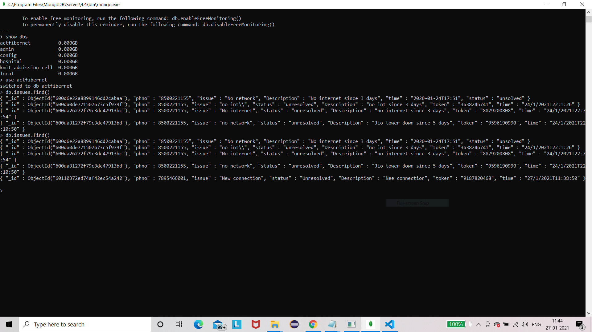

<h1>Making a fulfillment that retrieves user information from a Chatbot and stores it in a database.</h1>
https://bot.dialogflow.com/d59c2aab-86f7-44ed-93e6-9c71293a8112
<h2>Stage 1. Tunneling the db at localhost and the agent parameters which we receive on the web via ngrok. Setting up the ngrok to expose our webhook to the internet.</h2>

 <h2>Stage 2. Now we store the data fed to the chatbot to our mongodb collection </h2>

<h2>Stage 0. API TestingIt then retrieves user details based on the user's phone number.</h2>

